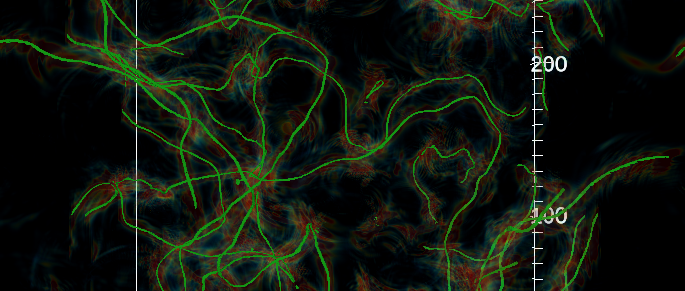

HILA
========= 


HILA (lattice in Finnish) is a C++ lattice field theory programming framework, aimed at HPC simulations.  

Purpose: make writing applications straightforward and intuitive, while producing optimized executables for 
different (super)computing platforms (parallelization with MPI, GPU computing with Cuda or HIP, AVX vectorization, 
etc.).  Details of the parallelization and computing architecture are hidden from the user's view, and 
all applications automatically run on present or future platform.
Write once -- run anywhere.

Hila is based on HILA preprocessor "hilapp", which is a C++ source-to-source transformer using the 
[libtooling](https://clang.llvm.org/docs/LibTooling.html) toolbox of the
[Clang](https://clang.llvm.org/) compiler.
It converts application C++ to platform-specific C++ code,
which is passed to appropriate compilers for the platforms.

Simplistic functionality which HILA promises is for example:

```cpp
Field<Complex<double>> f;
Field<double> g = 0;

onsites(ALL) f[X].gaussian_random();

foralldir(d){
  g[ALL] += abs(f[X+d] - 2*f[X] + f[X-d]);
}
```

Above we have created a random gaussian field and then interated over it with some operation that holds neighboring communication. We then store the result in a field initialized to zero. 

Hilapp handles the expansion of the above code into valid c++ code. Behind the scenes HILA takes care of MPI layout and communications.  It lays out the 
lattice fields differently for different computing platforms: 'array of structures' (standard),
'array of structures of vectors' (AVX-type), or 'structure of arrays' (GPU-type).

## Installation and documentation

Installation and user guide can be viewed on the [web documentation](https://cft-hy.github.io/HILA)

## License 

The GPL-2.0 license information can be reviewed at the [license](./LICENSE) page