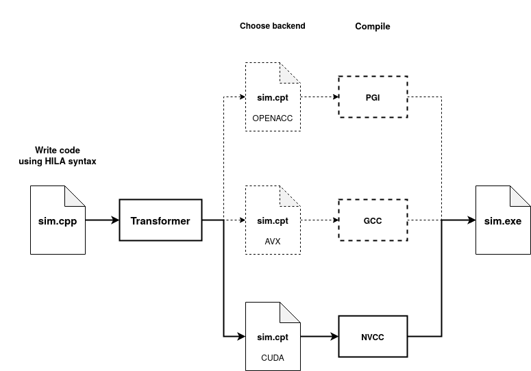

HILA Functionality
====================

This section is comprehensive description of the functionality HILA offers. For technical documentation each class, method, function etc. has been (work in progress) documented with standard docstring documentation which has been generated with doxygen.

## Makefile

The Makefile defines variables that allow control of the make compilation process and HILA applications. All the variables and example use are listed below, with the default options given as `VAR=default_option`.

`HILA_DIR:=../..`:

> Path to HILA directory with respect to application folder where the Makefile is defined. Default PATH is according to application folders being defined in `HILA/applications`, but by redefining `HILA_DIR` one can place application folder outside of `HILA` directory.

`ARCH:=vanilla`:

> Defines target architecture to build HILA application for. Default `vanilla` produces a CPU-MPI application. Architectures are listed on [Description and Installation](./README.md.md) page.

`CXX:=clang++`:

> Chosen application compiler. Any c++ compiler is viable, but only `clang++` is guaranteed to work.

`HILAPP_OPTS`:

> _hilapp_ options that can be appended to with for example `HILAPP_OPTS+= -check-init`
> <details>
> <summary> Option list </summary>
> 
> ```
>   --AVXinfo=<int>           - AVX vectorization information level 0-2. 0 quiet, 1 not vectorizable loops, 2 all loops
>   -D <macro[=value]>        - Define name/macro for preprocessor
>   -I <directory>            - Directory for include file search
>   --allow-func-globals      - Allow using global or extern variables in functions called from site loops.
>                               This will not work in kernelized code (for example GPUs)
>   --check-init              - Insert checks that Field variables are appropriately initialized before use
>   --comment-pragmas         - Comment out '#pragma hila' -pragmas in output
>   --dump-ast                - Dump AST tree
>   --function-spec-no-inline - Do not mark generated function specializations "inline"
>   --gpu-slow-reduce         - Use slow (but memory economical) reduction on gpus
>   --ident-functions         - Comment function call types in output
>   --insert-includes         - Insert all project #include files in .cpt -files (portable)
>   --method-spec-no-inline   - Do not mark generated method specializations "inline"
>   --no-include              - Do not insert any '#include'-files (for debug, may not compile)
>   --no-interleave           - Do not interleave communications with computation
>   --no-output               - No output file, for syntax check
>   -o <filename>             - Output file (default: <file>.cpt, write to stdout: -o - 
>   --syntax-only             - Same as no-output
>   --target:AVX              - Generate AVX vectorized loops
>   --target:AVX512           - Generate AVX512 vectorized loops
>   --target:CUDA             - Generate CUDA kernels
>   --target:HIP              - Generate HIP kernels
>   --target:openacc          - Offload to GPU using openACC
>   --target:openmp           - Hybrid OpenMP - MPI
>   --target:vanilla          - Generate loops in place
>   --target:vectorize=<int>  - Generate vectorized loops with given vector size 
>                               For example -target:vectorize=32 is equivalent to -target:AVX
>   --verbosity=<int>         - Verbosity level 0-2.  Default 0 (quiet)
> ```
> 
> </details>
> 
`APP_OPTS`:

> The makefile offers triggers that are defined in the application during compilation using -D opts. The options are control by the use of the `APP_OPTS` variable. All variables are documented in `params.h` of which the most notable is `NDIM`.
>
> For example if we wanted to set dimensionality at compilation it would be done as: ` APP_OPTS+="-DNDIM=4" `

## Datatypes

List of datatypes offered by HILA

### Standard types \<S\>: {#standard}

- `int`
- `int64_t`
- `float`
- `double`
- (`long double`?)

### Basic types: {#basic}

- Complex\<S\>
- #Vector\<n,T\>
- #RowVector\<n,T\>
- Matrix\<n,m,T\>
- #SquareMatrix\<n,T\>
- Array\<n,m,T\>
- SU\<n,T>

Here n,m\f$ \in \mathbb{N}\f$, S is any standard type, and T includes S and Complex\<S\>.  C++ or C standard complex types should not be used (not
AVX vectorizable). See respective links for documented functions/methods.

> __NOTE__: Matrix is defined with the base class Matrix_t (See documentation for details). #Vector, #HorizontalVector and #SquareMatrix are special alias cases of Matrix Class, so all methods are inherited.

### Special types

::Parity :

> enum with values EVEN, ODD, ALL; refers to parity of the site. Parity of site (x,y,z,t) is even if `(x+y+z+t)` is even, odd otherwise.

::Direction: 

> Conceptually a unit vector with values `±e_x, ±e_y, ±e_z, ±e_t`  (if NDIM==4). Implemented as an enum class.  Can be used to index arrays of size NDIM.

#CoordinateVector:

> Acts as a Coordinate Vector for indexing Field. All Vector algebra is well defined, since CoordinateVector inherits from #Vector which inherits from Matrix 
>
> __NOTE__: See CoordinateVector_t

#### Example of CoordinateVector and Direction usage:

Defining a CoordinateVector and Direction:

~~~cpp
CoordinateVector v
Direction d = e_x
~~~

Direction objects act as unit vectors when cast to CoordinateVector.
Additionally algebra acts as defined according to vector algebra:

~~~cpp       
v = d;             // v = [1,0,0,0]
v += e_y - 3*d;    // v = [-2,1,0,0] 
~~~

CoordinateVectors can be assigned with initializer list, where indices of list are aligned with CoordinateVector dimensions. Unit vector form with Direction's is also given:

~~~cpp
v = {0,1,-1,0};    // v = [0,1,-1,0]
v = e_y - e_z;     // equivalent to {0,1,-1,0}
~~~

Simple operations like a dot product are defined:

~~~cpp
int i = v.dot({1,2,3,4});  // dot product of 2 vectors, evaluates to -1
~~~

Since Direction is an enum it can be casted to int, but int cannot be assigned to it
~~~cpp
int j = d;         // ok
d = j;             // ERROR: cannot assign int to Direction
~~~

The ++d operator is also defined for Direction where it increase the direction in order \f$ \{e_x,e_y,e_z,e_t\} \f$. While --d operator is not defined

~~~cpp
++d;               // e_x -> e_y
is_up_dir(d);      // true if d is along positive x,y,z,t-dir. 
~~~

These are only some of the examples of what the CoordinateVector and Direction objects are capable of. For all definitions see coordinates.h, CoordinateVector and Direction pages.

## Field

Field is the most important Datatype offered by HILA. The Field defines the lattice, and is the general object we evolve and iterate over. The Field can be comprised of either [Standard types](#standard) or [Basic types](#basic) listed above.

To see all the possible methods of a Field see the class page which lists comprehensive documentation.

### Access and Traversal

The principal traversal of the lattice is with *site loops* `onsites(Parity)`, and a
special location identifier `X` (effectively a new keyword). Within the onsites loop `X` location identifier represents the current location of a point that is currently being indexed. __Note__ that the `X` identifier is only defined within onsites loops. Access operation `f[X]` can be applied only to field variables, and has the type of the
field element. `X` is of type X_index_type. All available methods can be seen in the class documentation. Note that the X_index_type class is only a dummy class with decelerations, yet _hilapp_ handles defining the contents of the methods, so the source is not available.

To illustrate how looping over a Field object works we will first define a few fields:
~~~cpp
  using mytype = Matrix<3,3,Complex<double>>;   // use type alias
  Field<mytype> f,g,h; // Default constructor assigns the fields to `nullptr`
  g = 2 // Assigning g to be 2*Id throughout the field
~~~

For a field comprised of square-matrix elements, real numbers are algebraically interpreted as \f$ 2 = 2\cdot\mathbb{1}\f$, multiples of identity matrix.

We can now iterate over the fields with the onsites loop:

~~~cpp
  onsites(ALL) f[X] = 2 + g[X];          // 2 acts as 2*I for square matrices
~~~

Above we linearly add each element at `X` from g to each element at `X` in f with an additional \f$2\cdot\mathbb{1}\f$ at each site. The ALL statement is a ::Parity which indicates that we will iterate over the whole Field. Other options are EVEN and ODD which indicate that we only iterate over the even or odd elements of the field.

Similarly we can write this same statement in the following short form:


~~~cpp
  f[ALL] = 2 + g[X];                     // equivalent shorter form for simple 1-line assignments
  f = 2 + g;                             // this is also equivalent!
~~~

Above you can also notice the simplest algebraic form, which allows for applying linear operations of the fields. The main difference is in sequencing: the first form goes through the lattice sites in one *site loop*, whereas the second stores the result of 2 + g to a temporary field variable which is copied to f (in this case std::moved). The site loop form is faster since it minimizes temporaries and memory accesses.

Now to demonstrate a more complicated onsites loop we will apply neighboring effects. 
~~~cpp
  parity p = EVEN;
  Direction d = e_x;

  onsites(p) {
      auto t = g[X + d];                 // fetch from neighboring site in the e_x direction
      f[X] += t + t*t;                   // can define variables in the loop   

      h[X] = g[X + e_x - 2*e_y];         // non-nearest neighbour fetch (TODO:optimize!)

      if (X.coordinate(e_t) == 0) {      // Do this on 1st timeslice only
          h[X] *= 0.5;
      }
  }
~~~

On the first line in the onsites loop we define a variable which we assign the `e_x` neighbor to. As we can see, variables can be defined within the scope of the loop.

Non nearest neighboring indexing also works, which is illustrated on the fourth line of the onsites loop. 

On line 6 of the onsites loop we can also see that if statements can be used to apply limitations, in the above case we use it to index a slice of the field.

Because `f[X]` is of type field element (in this case mytype), the methods defined for the element type can be used. Within onsites loop `f[X].dagger()` is ok, `f.dagger()` is not. `f[X]` also serves as a visual identifier for a field variable access.

### Additional features

#### Reductions

The Field object has the following reductions defined:

- Field::sum
- Field::product
- Field::min
- Field::max

Also sum and product reductions can be performed withing the onsites loops as:

~~~cpp
    mytype s = 0;
    mytype p = 1;
    onsites(ALL) {
      s += f[X] - g[X+e_x];
      p *= f[X] - g[X+e_x];

    hila::out0 << "The sum reduction is" << s << std::endl;
    hila::out0 << "The product reduction is" << s << std::endl;
~~~

#### Other features

Assignment and manipulation of external variables are illustrated below:
~~~cpp
    double a = 3, b = 5;
    Field<double> f, g=0;

    onsites(ALL) {
        f[X] = (a + b);            // ok, loop extern variables a,b do not change within the loop
        b = f[X];                  // ERROR: cannot change a loop extern non-field variable (except reductions)
        double c = sin(f[X]);      // ok, variable c defined within the loop
        f[X] = c + g;              // ERROR: using field variable g without [X]
    }
~~~

Field::shift operations allow shifting all elements by a certain displacement vector v. Even and Odd elements cannot be shifted with Field::shift method
~~~cpp
    CoordinateVector v = {0,1,1,0};

    f = g.shift(v);                // these three
    g.shift(v,f);                   //
    f[ALL] = g[X + v];             // are equivalent

    f[EVEN] = g[X + v];            // Cannot be done with g.shift() alone
~~~

Access field at a single point: `f[CoordinateVector]`.  This can be used only outside site loops.

~~~cpp
  CoordinateVector v = {2,3,4,5};
  auto value = f[v];              // "value" is broadcast to all nodes!
  f[v] = 1;                       // In assignment, values are not broadcast: the node which
                                  // owns site v must have correct rhs.
~~~


## Input library

Class hila::input can be used to read parameters and other data for simulations.
It matches key-value pairs from input files.

The available methods in the input class are:

- hila::input::open
- hila::input::close
- hila::input::quiet
- hila::input::get
- hila::input::get_value
- hila::input::get_item

As an example, if the file `parameters.dat` contains

```
    # this is a comment
    # Run parameters for run XYZ

    lattice size  64, 64, 64, 128
    beta          5.4
    clover        perturbative

    loops         25000
    seed          3474212

    coefficients    0.5, 0.7, 0.85, 1.3, 1.6, 2
    labels        setA, setB, setC
```

then the values can be read as follows:

~~~cpp
#include "hila.h"

int main(int argc, char * argv[]) {

    hila::initialize(argc,argv);

     
    // Open file to be read after hila::initialize
    // 
    // Input object is initialized with file,
    // that we want to read input data from
    hila::input p("parameters.dat");

     
    // Values are read in with hila::input.get as key value pairs
    // 
    // Values seperated with a delimiter ',' are read in as initializer lists,
    // thus the lattice size can be read into a CoordinateVector which supports
    // initialization with {x,y,z,t}
    CoordinateVector lsize = p.get("lattice size");
    double beta            = p.get("beta");

     
    // For values that have variability in it's types one can use hila::input.get_item
    // get_item allows the user to give a list of possible values for a given key.
    //
    // The user defines the list of possible values and get_item return's the index of the
    // value found. In our case key:clover is paired with value:"perturbative", thus 
    // input::get_item will return 1. After this we define an if statement to handle all
    // the possible situations depending on type.
    // 
    // After get_item is used the value assigned to the key:"clover" can be retrieved by
    // input::get() without argument. 
    int i = p.get_item("clover",{"tree","perturbative","%f"});
    double clover;
    if (i == 0) 
        clover = 1;
    else if (i == 1) 
        clover = <perturbative expression>;
    else 
        clover = p.get();  // the number is read here without key argument

    int loops       = p.get("loops");
    long rng_seed   = p.get("seed");

    // Similarly as above with the CoordinateVector we can read in "," seperated lists
    // into std:vector. Below we read in the 6 doubles assigned to the key "coefficients"
    std::vector<double> run_coefficients = p.get("coefficients");

    // Reading in std::string type also works as expected.
    std::vector<std::string> labels      = p.get("labels");

    // Lastly we close the file. Though the file will close automatically when the input
    // object get's out of scope
    p.close();   

    
    // lattice setup is convenient to do after parameters have been read
    lattice.setup(lsize);
    .
    .
    .
}
~~~

For more detailed description on the methods see hila::input class

## Check input and layout

The input files and the lattice layout can be checked with the 
commands (after the application program has been built)
~~~bash
   <hila-program-name> -check
   <hila-program-name> -check -n <number-of-nodes>       # without spaces
~~~
This runs the program without initializing MPI, Cuda or other hardware features and
exits at `lattice.setup()` before any large memory allocations are made.  If the 
number-of-nodes argument is given, program reports how the node layout is done.

__Example__: 

Running `hila_example` in directory `hila/applications/hila_example` with the command `build/hila_example -check -n 32` checks the input file and the layout for 32 nodes.

~~~bash
cd applications/hila_example
make -j4 hila_simple_example
./build/hila_simple_example -check -n 32
~~~

<details> 
<summary> Expected output </summary>

~~~bash
$ ./build/hila_example -check -n 32
****** INPUT AND LAYOUT CHECK ******
----- HILA ⩩ lattice framework ---------------------------
Running program ./build/hila_example
with command line arguments '-check -n 32 '
Code version: git SHA d117618b
Compiled Jun 21 2023 at 11:28:48
with options: EVEN_SITES_FIRST
Starting -- date Wed Jun 21 11:30:25 2023  run time 0.0005546s
No runtime limit given
GNU c-library performance: not returning allocated memory
----- Reading file parameters ------------------------------
lattice size         128,128,128
smear loops          100
smear coefficient    0.1
expansion order      12
random seed          3324565456
------------------------------------------------------------
------------------------------------------------------------
LAYOUT: lattice size  128 x 128 x 128  =  2097152 sites
Dividing to 32 nodes

Sites on node: 64 x 32 x 32  =  65536
Processor layout: 2 x 4 x 4  =  32 nodes
Node remapping: NODE_LAYOUT_BLOCK with blocksize 4
Node block size 2 2 1  block division 1 2 4
------------------------------------------------------------
***** Input check done *****
No timers defined
 No communications done from node 0
Finishing -- date Wed Jun 21 11:30:25 2023  run time 0.02263s
------------------------------------------------------------
~~~

</details>

If the application source had a typo in parameter reading, for example `lsize = par.get("latticesize");` then the output will notify the following:

<details> 
<summary> Expected output </summary>

~~~bash
$ ./build/hila_example -check -n 32
****** INPUT AND LAYOUT CHECK ******
----- HILA ⩩ lattice framework ---------------------------
Running program ./build/hila_example
with command line arguments '-check -n 32 '
Code version: git SHA d117618b
Compiled Jun 21 2023 at 11:28:48
with options: EVEN_SITES_FIRST
Starting -- date Wed Jun 21 11:34:54 2023  run time 0.0002599s
No runtime limit given
GNU c-library performance: not returning allocated memory
----- Reading file parameters ------------------------------
 lattice size       128,128,128
Error: expecting key 'latticesize'
Error: expecting 3 comma-separated ints after 'latticesize'
No timers defined
Finishing -- date Wed Jun 21 11:34:54 2023  run time 0.0005286s
------------------------------------------------------------
~~~

</details>

Additionally if the node layout is insufficient then the output would be:

<details> 
<summary> Expected output </summary>

~~~bash
$ ./build/hila_example -check -n 7
****** INPUT AND LAYOUT CHECK ******
----- HILA ⩩ lattice framework ---------------------------
Running program ./build/hila_example
with command line arguments '-check -n 7 '
Code version: git SHA d117618b
Compiled Jun 21 2023 at 11:28:48
with options: EVEN_SITES_FIRST
Starting -- date Wed Jun 21 11:36:22 2023  run time 0.0003294s
No runtime limit given
GNU c-library performance: not returning allocated memory
----- Reading file parameters ------------------------------
lattice size         128,128,128
smear loops          100
smear coefficient    0.1
expansion order      12
random seed          3324565456
------------------------------------------------------------
------------------------------------------------------------
LAYOUT: lattice size  128 x 128 x 128  =  2097152 sites
Dividing to 7 nodes

Using uneven node division to direction 0:
Lengths: 2 * (19 sites) + 5 * (18 sites)
Divisions: 19 - 18 - 18 - 19 - 18 - 18 - 18
Filling efficiency: 96.2406%
NOTE: number of smaller nodes > large nodes 

Sites on node: (18-19) x 128 x 128  =  294912 - 311296
Processor layout: 7 x 1 x 1  =  7 nodes
Node remapping: NODE_LAYOUT_BLOCK with blocksize 4
Node block size 1 1 1  block division 7 1 1
------------------------------------------------------------
***** Input check done *****
No timers defined
 No communications done from node 0
Finishing -- date Wed Jun 21 11:36:22 2023  run time 0.06517s
------------------------------------------------------------
~~~

</details>

## HILA pre-processor tool

The _hilapp_ tool is not something that generally the user should worry about, but to get a better understanding of what happens under the hood we offer the following explanation.

In short, the workflow with the _hilapp_ tool works in the following manner: 

1. Write c++ code using the syntax and datatypes described above

2. Use the _hilapp_ executable to convert this code into .cpt code 

~~~bash
bin/hilapp path/to/program.cpp
~~~

This will create a `cpt` file which is essentially standard C++.

3. Compile the new .cpt code into the final executable

The `cpt` can be compiled with any c++ compiler, but must be linked against the headers and c++ files in the plumbing directory.

